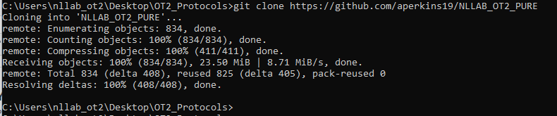
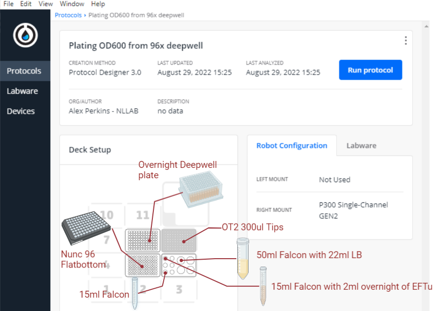

# Guide to Automated OD600 Plating Using the OT2

This guide will walk you through how to perform OD600 measurements of the overnight cultures of the PURE system.

I hope this document provides all the information you need but feel free to ask a lab member at any point if you're unsure.


## Materials


First, turn on the OT2 and login to the computer. Please ask a lab member for the password.  

Next, open the OT2 Software and make sure it is connected to the OT2.  
You can confirm this by turning the lights on.


See if the protocol already exists by opening the **OT2_Protocols** folder on the desktop.  
You should see NLLAB_OT2_PURE, if it's not there then follow the instructions in the **Downloads** section below. If it is there then skip to **The Files**.

#### Download

Download the repository by opening a terminal or command line, navigating to your desired folder on your local machine or the OT2 machine.  
Use the Change Directory command. An example is given below but use your folder of choice:

e.g.
```bash
cd Desktop/OT2_Protocols
```

If you're successful, you'll see something like this:


Next you need to download the repository using the git clone command:

```bash
git clone https://github.com/aperkins19/NLLAB_OT2_PURE
```
If you're successful, you'll see something like this:




#### The Files

Now open the folder in your file system:


And navigate into **OD600_OT2**.  


You should see the following files, this contains everything you need to perform the OD600 dilutions with the OT2, reading the plate with the Biotek H1 plate reader and the analysis.  

* **OT2_Script_Plating_OD600_from_96x_deepwell.json**: The OT2 Script
* file 2

#### The Labware

* 1 full box of clean 300ul OT2 pipette tips (# product code).
* 1 50ml Falcon Tube with **exactly** 22ml of fresh LB media.
* 1 OT2 Falcon Tube rack for 6x 15ml and 4x 50ml Falcons.
* 1 Clean Nunc 96 black flat bottom plate (**#655906**).
* 1 15ml Falcon with the 2ml overnight of EFTu, strain #25.
* 1 15ml Falcon, clean and sterile.
* 96x deep well plate (**#260252**) with 300ul overnights in the format below:


## Setting up the OT2

I *highly recommend* performing a deck calibration before you go any further. The OT2 is fickle creature and you don't want to mess up your samples with a crash.  
You can do this by clicking here and following the instructions. **Be sure to do it as accurately as you can**:  


**Next, you need to upload the OT2 script. Go to the Protocols tab and select** *Choose File*, **then select** *OT2_Script_Plating_OD600_from_96x_deepwell.json*.


**Now place the labware securely into the OT2 using the diagram below.**



**Your deck should look like this. Make sure everything is secure!**


**Now select "Run Protocol", Select the OT2 and "Proceed to setup" at the bottom.**

Hopefully you will have a "Calibration Ready" next to Robot Calibration. **This is solely for the Deck**, keep scrolling down until you find *Run Labware Position Check*.  
Select it and follow the instructions. **This is very important.**


#### Calibration Offset Check

You will probably have to adjust the labware offsets. Do this by selecting **Reveal Jog Controls**.
Make sure that what you're positioning is centered exactly over the centre of what you're positioning it over.  
In terms of height (Z axis) you want the pipette tip to be *just* above the top of the well or tube. The gap should be with in 0.1mm, so a tiny slither of light. Having said that, it's better to have it slightly too high than too low. Even though the labware is supposed to be made to very high spec, warping and tiny deviations can been that, for example: At the bottom of well A1, the tip is 0.1mm above the bottom of the well but at the bottom of G7, the tip might touch the bottom. This means that the tip will not aspirate/dispense leading to a build up in pressure which is released when the tip moves up again. This leads to greatly increased technical error and possibly your sample being flung across the robot.  
So do this carefully and err on the side of caution.  
The picture below illustrates what you're after.


## The Protocol

The protocol has two distinct phases: **OD600 Plating** & **Inoculum Compilation**.

### OD600 Plating

This section yields a Nunc 96 Flat-Bottom containing PURE Overnights 10x dilutions ready for absorbance measurement in the plate reader. It takes ~55mins.


The following function repeats for every overnight on the deep well plate:

For illustrative purposes, the loop will be described in terms of strain #1 in well A1.

* The robot picks up a new tip
* Aspirates 270ul of fresh LB from the 50ml Falcon and dispenses into A1 of the Nunc 96 Flat-Bottom.
* Aspirates 30ul of Overnight Culture from A1 of the Deep Well plate and Dispenses into A1 of the Nunc 96 Flat-Bottom with a short mix step.
* Trashes the tip.

This is repeated for all PURE overnights and maps the deep well to the nunc. Except for EFTu (Strain #25) in the 15ml Falcon which is in A1 of the tube rack and is plated into the Elongation Factor Section between #24 & #25.

**Blanks**

The section ends with dispensing 300ul of LB into wells H11 & H12 to serve as blanks.


### Inoculum Compilation

**Feel free to remove the OD600 plate for measurement at this point (instructions below).**

After plating the diluted OD600 samples, the protocol progresses to the Main Master Culture Inoculum Compilation. The purpose is to take 55ul of each culture (Except EFTu which is 1675 ul) and compile them into one tube ready for adding straight to the culture.  

* It then transfers 1675 ul of EFTu from A1 to C1 in multiple steps.
* The robot takes 55ul from each culture in a "multi-aspirate" step (figure below) and dispenses them into a clean 15ml Falcon in C1 of the Tube Rack.

**Feel free to remove the compiled Inoculum for starting the main culture at this point.**
