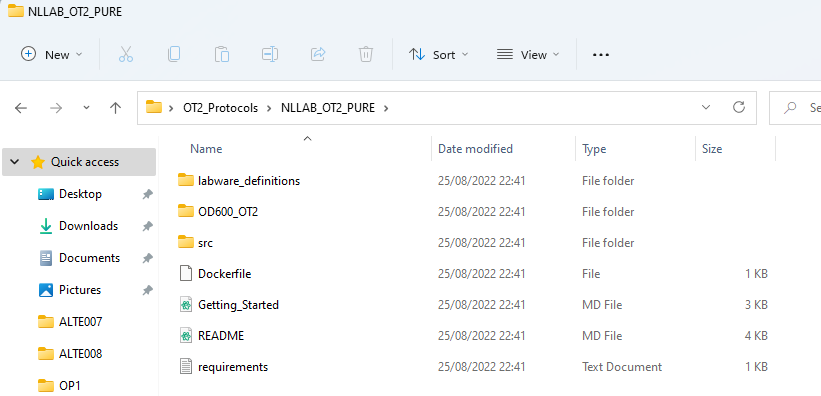

# Guide to automated OD600

This guide will walk you through how to perform OD600 measurements of the overnight cultures of the PURE system.

I hope this document provides all the information you need but feel free to ask a lab member at any point if you're unsure.


## Materials


First, turn on the OT2 and login to the computer. Please ask a lab member for the password.  

Next, open the OT2 Software and make sure it is connected to the OT2.  
You can confirm this by turning the lights on.


See if the protocol already exists by opening the *OT2_Protocols* folder on the desktop.  
You should see NLLAB_OT2_PURE, if it's not there then follow the instructions in the *Downloads* section below. If it is there then skip to *The Files*.

#### Download

Download the repository by opening a terminal or command line, navigating to your desired folder on your local machine or the OT2 machine.  
Use the Change Directory command. An example is given below but use your folder of choice:

e.g.
```bash
cd Desktop/OT2_Protocols
```

If you're sucessful, you'll see something like this:


Next you need to download the repository using the git clone command:

```bash
git clone https://github.com/aperkins19/NLLAB_OT2_PURE
```
If you're sucessful, you'll see something like this:


#### The Files

Now open the folder in your file system:



And navigate into *OD600_OT2*.  


You should see the following files, this contains everything you need to perform the OD600 dilutions with the OT2, reading the plate with the Biotek H1 plate reader and the analysis.  

* file 1
* file 2


## Setting up the OT2

I *highly recommend* performing a deck calibration before you go any further. The OT2 is fickle creature and you don't want to mess up your samples with a crash.

Next, you need to upload the OT2 script. Go to the Protocols tab and select Upload Protocol.